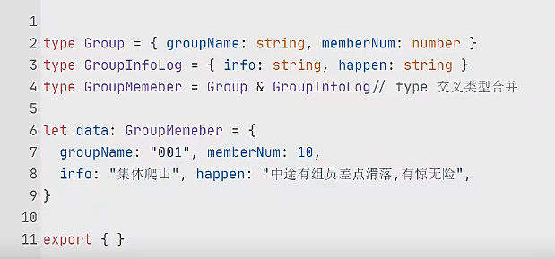
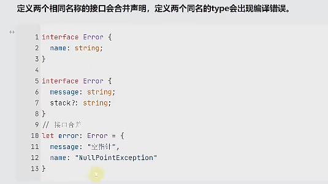
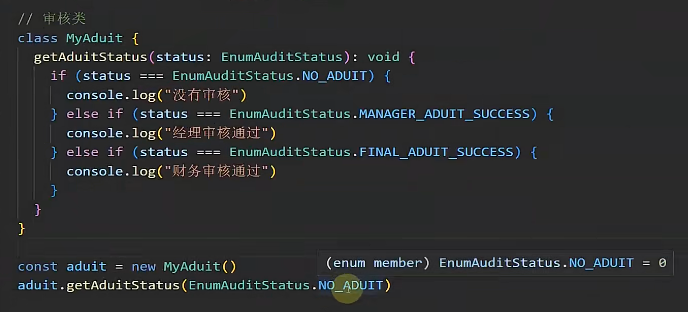

# 优势
1. 静态类型的检测,规避开发期间的大量的低级错误
不同数据类型,
比如一个变量并不是数组但是使用了数组的方法js并不会报错而是会将错误推迟到运行的时候为项目留下隐患  

2. 自动提示更加清晰明确

比如对象提示词快速准确提示属性,js的话也会提示但是,混杂着很多其它名称时

3. 泛型等ts特性
4. dts生命文件
5. 轻松编译js文件
6. 灵活性高,类型多但是有断言


# 编译js文件
在tsconfig.json中配置
找到根目录和输出目录打开
    "rootDir": "./allchapter/2chapter/src",                              
    "outDir": "./allchapter/2chapter/dist", 
使用tsc命令编译会全部输出到dist目录下

# ts的数据类型

1. 基本数据类型js有的
2. 根类型 Object,{}
所有类型的父类,其他类型都可以赋值给它(除了null,undefined)
3. 对象类型Array ,Function ,object,inteface
注意大写的Object是根对象,小写的是仅仅是对象类型,定义的变量也只能接受对象类型
  1. interface : 用于声明对象类型，接口当中的属性和方法都只有声明没有实现
     应用场景: 
     1. 可以继承,在父类当中不能定义的方法,通过子类在子类当中括扩展
     2. 第三方包或者框架底层源码中有大量的接口类型
     3. 为同类别的类提供统一的方法和属性声明
        //一个接口可以衍生出非常多的,接口可以为这些类的共同的方法统一方法命名
        //也就是需要去实现这些接口定义不然会编译器报错
        //就像说明书和目录一样,方便维护
    特殊：
     1. 可索引签名，允许实例化对象增加属性
     2. 接口重名的时候呢是会合并里面的内容的
     3. // 通过泛型迭代出接口所有的类型
        ```ts
        type AllKeys<T> = T extends any ?  T : never
        type F = AllKeys<keyof Product16>
        
        ```
    接口和type的区别(2-23):
    1. type可以定义任何类型,但是interface只能定义对象类型,还有函数
        ```ts
            interface Adder {
        (x: number, y: number): number;
        }
        let add: Adder = function(x: number, y: number): number {
        return x + y;
        };

        // 或者使用箭头函数
        let add: Adder = (x: number, y: number) => x + y;

        // 使用这个变量调用符合接口定义的函数
        const result = add(1, 2);
        ```
    2. 接口可以继承接口或者是type(非常少见),可以继承多个接口的
        接口继承的时候呢,同名的属性会冲突报错
    3. type交叉类型& 可让类型中的成员合并成一个新的type类型,但是接口不能交叉

    

    4. 接口可以合并声明但是type不能合并声明

    

  2. function 类型
        通过变量限制函数的类型
        ```ts
        //这样写的话呢右边的函数类型就有了约束
        let fn1:(n: number)=>void = function (n: number): void {
            console.log(n)
        }
        fn1(1)
        //改进写法
        type TypeInfoFun = (name:string,age:number)=>number
        let info1:TypeInfoFun = function (name:string,age:number):number {
            return age
        }
        // 可以设置后续的参数
        function fn2(name:string,...rest:any):void{
        
            console.log(name,rest)
        }
        fn2('',1,2,3,4)
        ```
    
4. 枚举类型enum
    1. 为什么要使用枚举?枚举显著最大的好处
    例子: 当有一个对象通过外部输入时来呈现一个状态,我们会去使用一个常量,但是常量的话也是需要规定类型
    类型,类型的话就比较宽泛,项目一旦变大的话呢不利于阅读,我们就可以使用枚举类型

    简单的说就是当传递一个常量给一个函数的时候,该参数类型一般不够直观,降低代码的可读性和可维护性
    2. 枚举的定义,分类和取值方式
        1. 类型:
        - 数字类型:具有属性和值的双重映射
        - 字符串类型:没有双重映射,和普通对象没有啥区别
        2. 取值:
        ```ts
        console.log(week.sunday);
        console.log(week['monday']);
        console.log(week[2]);
        ```
    3. 好处和应用
       1. 有默认值和自增值节省编码时间
       2. 可读性强
    
5. 其它类型
    any,unknown,never,void,元组,可变元组
    1. never
    这个函数穷尽了所有的DataFlow类型的可能类型
    使用never 避免未来扩展新的类没有对应的类型实现,目的就是写出类型绝对安全的代码
    2.  
        - any,unknown的区别以及应用场景
            1. any:any类型可以赋值给任意类型,而且any类型能赋值给任意类型
            2. 任何类型可以赋值给unknown类型
            unknown:unknown类型只能赋值给any类型,
            不能赋值给其他类型,
            不能获取变量的属性和方法,但是any可以
            3. Object和any的区别
            根类型赋值为null和undefined,但是any可以
            根类型也并不能赋值给其他类型,但是any可以
        - 哪些数据类型接受undefined
    3. ts当中的void和js中的void的区别
  void的话再js当中是让函数执行之后让返回值为undefined，
  但是ts当中除了规定函数的返回值类型之外，还规定函数的参数类型，这个参数只接受undefined
  注意---undefined和null类型不能互相赋值----
6. 联合类型，交叉类型
    1. 联合类型|,或的关系
    联合类型就是表示该变量可以是多种类型
    在ts当中变量的提示词给出的选项也会是这两个类型都有的
    2. 交叉类型,交集,变量类型必须全部满足
7. 字面量数据类型
    ``` ts
    type num = 1 | 2 | 3
        function isStartUp(increase:boolean|num){
            if(increase){
                return 1
            }else{
                return 2
            }
        }
        isStartUp(2)
    ```
# 问题
## 可选参数
```ts
   //函数参数增加可选 可选符号的行为
    //1. 会将函数参数的类型增加一个联合类型undefined
    //2 .而且这个参数也可以不传
    function fn(a?:number){
        console.log(a);
    }
    function fn1(a:number){
        console.log(a);
    }
    //可选参数在处理的时候
    function fn2(a?:string){
        a!.toString ()
        if(a){
            a.toString()
        }
    }
```
##
## 类型的大小写问题
在 TypeScript 中书写类型注解时，大写的类型通常代表包装对象类型，而小写的类型代表原始数据类型或其他非对象类型。为了确保代码的意图得到正确表达并充分利用 TypeScript 的类型系统，建议在大多数情况下使用小写类型。
## 索引问题
```ts
//不固定的字符串作为固定对象的索引
//就会报错
{
  let obj :object= { username: "wanghu", age: 12 };
  const name:string = "username";
  let u = obj[name] 
}
```
