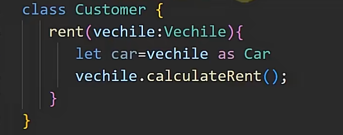
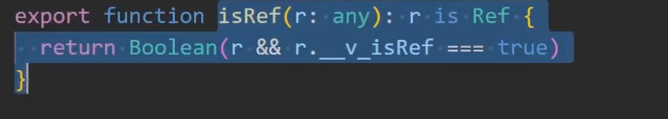

# 类型守卫,类型转换

## 类型守卫相关 JS:typeof 局限性和替代方案

类型守卫+应用
自定义守卫
自定义守卫晋级

## 断言 AS 类型断言

绕过 ts 编译检查;说这个变量就是类型无需检查

子类可以断言为父类
子类可以赋值给父类,也可以断言回子类

### 预备知识

父类类型变量可以接受子类的赋值

### 例子 1

父类的变量可以接受子类的对象
在某个函数当中如果接受的是子类声明的是父类,但是后面需要调用子类的属性
就需要断言 as


#### 也可以使用 instanceof 替换掉

用于方法内部判断,不同情况的判断

```ts
if (obj instanceof Son) {
}
```

### 例子 2 子类类型转化为父类

```ts
//当使用字符串变量名来访问对象属性的话,因为变量是会变化的,编译器报错
// 1. 解决使用const 定义符号变量
// 2. 使用as any,存在场景就是外部给你传递的变量,所以不能确定是const ,as any就能解决这个问题
let symid53_1 = Symbol("sym");
let user53_1 = {
  [symid53_1]: "admin",
  name: "John",
  age: 30,
};
let name53_1 = "name";
console.log(user53_1[name53_1 as any]);
```

## 类型转换
### 定义:
编译器强制转化一个类型为另一个类型


## 类型守卫 Type Guard
### 定义: 在语句的块级作用域if语句或条目运算符表达式内 缩小变量的一种类型推断
### 类型守卫产生时机: ts条件语句遇到以下关键词的时候,缩小变量的类型范围
### 场景:一个函数参数为两个对象的联合类型,需要判断类型
```ts
interface user1 { name: string }
interface user2 { firstName: string, lastName: string }
function getName(user: user1 |user2) {
    
}

```
### 1.instanceof
一个函数的参数为联合类型所给的提示词,会是是所有类型都有的
使用instanceof判断类型,后精准提示
### 2. in
通过独有的属性存在的属性来判断类型
### 3. typeof
类似于instanceof,但是tyepof只能判断基本类型,能够判断的准确的引用数据类型是 function
### 4. 字面量相等

## 自定义类型守卫
在if判断语句当中使用自定义函数来缩小变量的类型范围
### 定义
function 函数名(形参:类型参数[一般都是any]):形参 is 类型名{
  return true or false
}
### 注意在类型只有两种的情况下也可以使用取反表示另一种类型

### 使用和类型守卫一样
1. 在if语句当中使用
2. 在三元运算符当中使用(vue3源码当中也有)

### 作业
自定义守卫如何判断promise类型