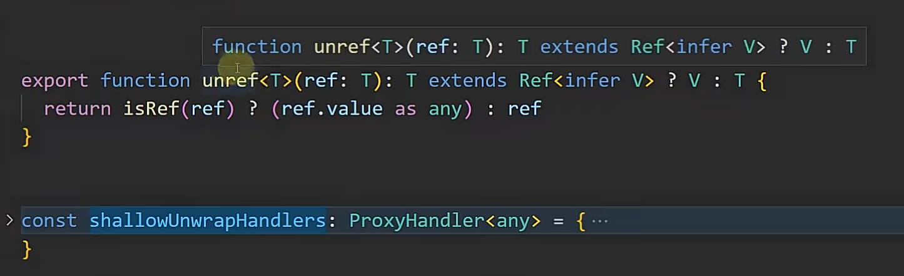
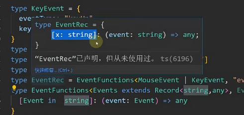

# 一、 infer 面试经常被问 
## infer [三种用法](./src/8-1.ts)
可以获取到函数类型,泛型函数的参数类型和返回值类型
### 1. 定义表示在extends条件语句中以占位符出现,等到使用时才推断出来的数据类型
### 2. 应用场景:
1. 函数参数类型推断:
```ts
    //只要满足条件能获取到infer位置的类型,顺序不能调换,最后的类型可以变动
    type CustParaTyp1 = CustFn extends(params :infer P)=>string?P:CustFn

    //获取多个参数类型的情况
    type Func = (arg1: string, arg2: number, arg3: boolean) => void;

    // 定义一个帮助类型，用于递归地将函数参数类型展开为联合类型
    type UnionOfFunctionArgs<F> = F extends (...args: infer P) => any ? P : never;

    // 应用到我们的函数类型上
    type ArgsUnion = UnionOfFunctionArgs<Func>;

    // ArgsUnion 现在是 'string' | 'number' | 'boolean'
    //返回值是多种类型的话,R会是一个联合类型
    type CustParaTyp2 = CustFn extends(params :any)=>infer R?R:CustFn
```

2. 泛型函数类型:
```ts
// 拿到泛型类型中的类型
type ParamsTyp<T> = T extends (params:any)=>infer R?R:T 

type CustParaTyp3 = ParamsTyp<CustFn>

```
3. 泛型数组的类型:
```ts
//数组泛型
type EleOfArr<T> = T extends Array<infer E>?E:never
type EleOfArrTyp = EleOfArr<Array<string>>
```
### 3. [在vue3源码当中的解套应用](./src/8-3.ts)
1. 也就是简单的获取泛型中的一个类型

2. 在最后的return语句当中as any的使用
编译器并不知道实际类型,所以需要as any

### 4. [获取set<objType>中的类型 ](./src/8-2.ts)


# 二、类型体操 vue3 源码阅读
类型递归
### unwrapRef的实现

# 三、条件类型
## 1. 作用
将联合类型当中的类型单独拿出和后面比较 extends ?:
```ts
type ConTyp<T> = T extends string | number ? string : never
type TestTyp86 = ConTyp<string|number |boolean>
```
## 2. 应用场景 [7-11.ts](../7chapter/src/7-11.ts)
简化代码对于变量类型的判断
将这种通用代码提取出来,更加方便维护
比直接使用extends限制类型的话呢更加便统一于维护
```ts
// 使用条件类型优化
type CrosTyp<T> = T extends object ? T : never;

```

## 3. 复杂运用 [8-6.ts](./src/8-6.ts) 
### 背景
当我有一个接口的时候,在后续当中需要增加属性为这个接口

# 四、keyof 的实战 [8-8.ts](./src/8-8.ts)
## 模块扁平化
### 好处:
清晰地读取到模块结构

# 五、TS高级类型:Extract,Exclude,Record,Pick,Omit,Capitalize
## 1. extract 和 exclude   [8-9.ts](./src/8-9.ts)

### 实现原理:
Extract将符合条件的进行输出
Exclude将符合条件的去除
```ts
type Extract<T, U> = T extends U ? T : never;
type Exclude<T, U> = T extends U ? never : T;
```
### 作用
```ts
// 会将前面类型中拿出类型来，和后面的进行条件判断，符合则输出
type ExtractTest = Extract<'a' | 'b' | 'c', 'a' | 'f'>;
```
```ts
// 会将前面类型中拿出类型来，和后面的进行条件判断，不符合则输出
type ExcludeTest = Exclude<'a' | 'b' | 'c', 'a' | 'f'>;
```

### 用法：
自己再次封装一下
```ts
//对传入的泛型进行一个限制
type Exclude_<T> = Exclude<T,string| number | object>
type Extract_<T> = Extract<T,string| number | object>
```
### 好处:
统一命名,在大型项目当中，统一命名


## 2. record 类型 [8-12](./src/8-12.ts)

### object类型的使用场景
1. 创建一个对象,但是这用创建的对象没有提示
2. 限制函数的参数类型
### 原理
key of any的一个解析的结果得到的类型也就只有三种,但是也够用
string|number|symbol

前面解析属性名,后面解析类型
```ts
type Record<K extends keyof any, T> = {
    [P in K]: T;
};

```

### 应用
1. 对对象的属性名类型的一个限制
当你不想定义接口的话
2. 使用record的话会有提示机制(泛型)
提示机制的本质是因为在类型当中就定义了这些类型


## 3. pick类型 [8-17.ts](./src/8-17.ts)
pick 主要用于抓取type类型,接口,类当中的一个属性,生成新的类型

### 原理:
```ts
type Pick<T, K extends keyof T> = {
    [P in K]: T[P];
};
```
## 4. omit类型 [8-18.ts](./src/8-18.ts)
将一个接口当中的某些属性删除掉,而保留大部分的
相对于pick类型,保留几个属性而删除大部分的属性
### 原理:
底层原理先得知你不要的属性的联合K,然后使用exclude,将K从所有的联合属性T中删除掉
之后使用Pick保留下剩余的属性
```ts
type Omit<T, K extends keyof any> = Pick<T, Exclude<keyof T, K>>;
```
# 解决使用keyof 获取对象属性联合类型的时候提示不明显 [8-11.ts](./src/8-11.ts)

## 例子
```ts
interface Customer811 {
  name: string;
  age: number;
  address: string;
}
//直接使用keyof 关键字获取 Customer811 的所有属性
type CustomerKeys8111 = keyof Customer811;
// 更加直观的看到类型
// 因为这种写法会拿类型一个一个去比较所以会更加的直观
type Directkeys<T> = T extends any ?   T : never;
type  CustomerKeys8112 = Directkeys<keyof Customer811>
```


# 对象的深拷贝 [8-13.ts](./src/8-13.ts)
isPlainBoject类型

## 如何去判断是对象还是数组


# ts当中映射类型的高级玩法 [8-18.ts](./src/8-18.ts)
## 映射类型
其核心在于使用[K in keyof T]语法来遍历原有类型的键，
并对每个键应用某种变换规则来生成新的类型结构。
## omit类型
将一个接口当中的某些属性删除掉,而保留大部分的
相对于pick类型,保留几个属性而删除大部分的属性


# 综合应用Record,Capitalize,Exclude [8-19.ts](./src/8-19.ts)

## 模版字符串中添加类型
将一个类型添加到模版字符串当中,为了编译不报错的话,可以加上&string
```ts
type Degree <T>={
    //满足前面的条件又要满足后面的条件
    // 模版字符串可以来修改键名
    [P in keyof T as T[P] extends Function ?  `${Capitalize< P&string>}`:never ]:T[P]
}
```
## capitalize
将字符串首字母大写
```ts
//capitalize测试
type test819= 'do'
//将属性名大写
type Todo819Capitalize = Capitalize<test819>
```


## 大厂面试题
限制传入类型为对象的时候要是传入一个数组怎么办

## 使用Exclude二次封装对数组和函数进行约束
但是直接在参数record外添加Exclude并不能约束
,因为Exclude只能约束联合类型,但是record是一个映射类型,所以,直接使用的话并不能起作用
# 六、映射类型
# 七、诡异的复杂映射类型应用 [8-20.ts](./src/8-20.ts)

## 联合类型存在的问题
1. 就使用联合两个接口类型的话,那么联合类型就是留下两个接口共同的属性,而且属性的类型为两个接口的联合类型
2. 发散思维要是两个接口交叉的话呢会是never
```ts
type MK = MouseEvent820 | KeyboardEvent820
// let mk: MK 
// mk.
```

## in 关键字使用的问题
后面接的对象限制为 symbol string number,也可以写成字面量类型(会识别成字符串)

### in 的死规则,前面的属性变成可索引签名 
[x in string]   变成  [x:string],记住这个规则就行



### 绕过检查
当in后面接的类型是有错误的会直接去找as后面的,重新映射


# 八、TS的高级辅助类型
以下这两种可以一起使用

## 1. 去除增加可选属性-? +?

也有内置的
```ts
type Required<T> = {
    [P in keyof T]-?: T[P];
};
type Partial<T> = {
    [P in keyof T]?: T[P];
};
```
## 2. 增减-+readonly
内置
```ts
type Readonly<T> = {
    readonly [P in keyof T]: T[P];
};
```


# 大中型项目的实战 [8-24.ts](./src/8-24.ts)