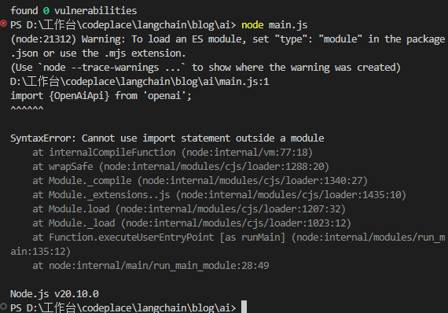

## js 和 aigc

- 简历要有所表现
    - AIGC
    了解OPENAI相关接口和LLM的应用,在接触langchain AI应用框架
    - langchain js 版本
    - node 工程 koa 3000 mvc sql
    koa 1314 ai功能 增量式开发
    - koa的作用是 ? 
     1. 启动一个http server
     2. router
     3. mvc 后端应用开发框架
    - langchain LLM开发框架
    项目当中的ai功能的接口大致长成这样,独立出来一个ai的文件夹
    langchain的话作用,内部调用大模型,直接调用接口,代码易于复用,如果直接调用接口,偏向于底层代码会很复杂,
    http://localhost:1314/ai/get_word

    ## JS模块化的发展史
    js 早期没有模块化的概念,文件的加载顺序手动控制,项目越来越复杂,所以引入了模块化
    ```js
    <script src="./a.js"> </script>
    <script src="./b.js"> </script>
    <script src="./c.js"> </script>
    ```
    a.js中可能定义了基类,后面两个文件依赖a.js,因为有阻塞制
    script标签是发送一个http请求文件,会阻塞后面代码的运行,除非是在后面加上deffer

    node common.js
    js是什么? 语言->编译成二进制  v8引擎 chrominum 内核 不包含浏览器ui
    node 底层是由c++封装了chromeinum 内核的js引擎,所以nodejs是js的运行环境
    - commonJS 规范 
        增加commJs的原因,因为node.js是负责后端,后端天生复杂,而js是单线程
        require module.exports()
    - ESmoudle
        后端服务器运行很快,没有懒加载和异步等,而前端性能要求更加极致需要一个符合前端的模块化规范
        随着vue和react的流行 也变得复杂了,所以前端也需要模块化,但是commJSbingmodule是后端的规范,所以前端需要一个前端的模块化规范
        其实现在node也支持了ESmoudle,因为node.js
    - mjs是啥？
    node安装的新版本,可以直接支持esmoudle,如果老一点的版本要使用mjs后缀来声明,表示该文件
    如果直接使用import,会报错,但是改成mjs后缀就能自动识别
    
        mjs是ESmoudle的简写,是ESmoudle的简写,所以mjs