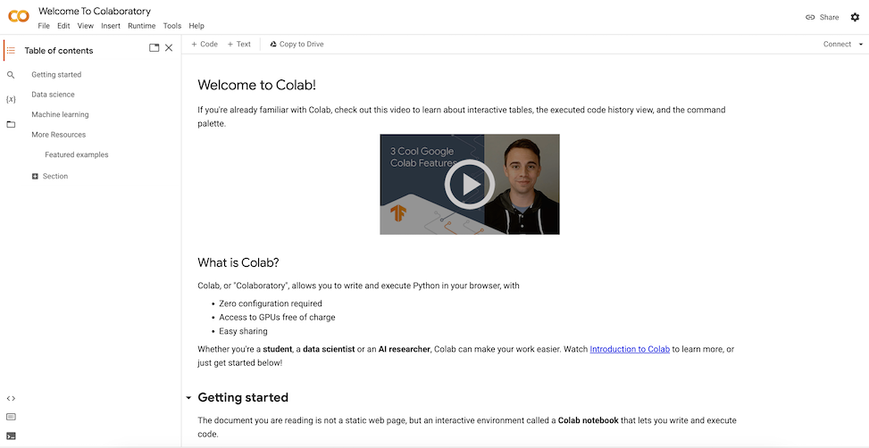

# WTF Langchain极简入门: 01. Hello Langchain

最近在学习Langchain框架，顺手写一个“WTF Langchain极简入门”，供小白们使用（编程大佬可以另找教程）。本教程默认以下前提：
- 使用Python版本的[Langchain](https://github.com/hwchase17/langchain)
- LLM使用OpenAI的模型
- Langchain目前还处于快速发展阶段，版本迭代频繁，为避免示例代码失效，本教程统一使用版本 **0.0.235**

根据Langchain的[代码约定](https://github.com/hwchase17/langchain/blob/v0.0.235/pyproject.toml#L14C1-L14C24)，Python版本 ">=3.8.1,<4.0"。

推特：[@verysmallwoods](https://twitter.com/verysmallwoods)

所有代码和教程开源在github: [github.com/sugarforever/wtf-langchain](https://github.com/sugarforever/wtf-langchain)

-----

## Langchain 简介

大型语言模型（LLM）正在成为一种具有变革性的技术，使开发人员能够构建以前无法实现的应用程序。然而，仅仅依靠LLM还不足以创建一个真正强大的应用程序。它还需要其他计算资源或知识来源。

`Langchain` 旨在帮助开发这些类型应用程序，比如：
- 基于文档数据的问答
- 聊天机器人
- 代理

## OpenAI 简介

`OpenAI` 是LLM生态的模型层最大的玩家之一。大家目前熟知的 *GPT-3.5*，*GPT-4* 等模型都是OpenAI的产品。它的API允许开发人员通过简单的API调用来访问这些模型。

## Langchain与OpenAI

`Langchain` 作为一个开源框架，提供与OpenAI等语言模型的接口，简化了在应用程序中集成和利用语言模型能力的过程。

## 开发前的准备

在开始第一个Langchain应用程序之前，我们需要做一些必要的准备。

### Google Colab

本教程中，我们将使用 `Google Colab` 在云端运行 `Python` 代码。Google Colab（全称Google Colaboratory）是一个由Google提供的云端开发环境，用于数据分析、机器学习和深度学习任务。它基于Jupyter Notebook，提供了一个免费的、云端的Python编程环境，用户可以直接在浏览器中编写和执行Python代码。

网址：[https://colab.research.google.com/](https://colab.research.google.com/)



无法使用Google Colab的同学，可以使用Visual Studio Code配合Jupyter插件在本地运行代码。

### OpenAI API Key

在Langchain应用中使用OpenAI的模型，我们需要一个API Key。点击[https://platform.openai.com/account/api-keys](https://platform.openai.com/account/api-keys)创建你的API Key。

## 第一个 Langchain 应用

这个简单的程序只有 1 行安装指令和 7 行代码：

### 安装指令

```shell
pip install langchain==0.0.235 openai==0.28.1
```

### 代码

[Hello_Langchain.ipynb](./Hello_Langchain.ipynb)

```python
from langchain.chat_models import ChatOpenAI
from langchain.schema import HumanMessage

import os
os.environ['OPENAI_API_KEY'] = '您的有效OpenAI API Key'

chat = ChatOpenAI(temperature=0, model_name="gpt-3.5-turbo")
response = chat([ HumanMessage(content="Hello Langchain!") ])
print(response)
```

你应该能看到类似这样的输出：

```shell
content='Hello! How can I assist you today?' additional_kwargs={} example=False
```

我们拆解程序，学习该代码的结构：

1. 以下系统命令安装必要的Python包，langchain和openai。

  ```shell
  pip install langchain==0.0.235 openai
  ```

2. 以下代码将OpenAI的API Key设置在环境变量中。默认情况下，Langchain会从环境变量 `OPENAI_API_KEY` 中读取API Key。注意，在代码中直接嵌入API Key明文并不安全，切勿将API Key直接提交到代码仓库。我们建议利用.env文件和python-dotenv包来管理API Key。

  ```python
  import os
  os.environ['OPENAI_API_KEY'] = '您的有效OpenAI API Key'
  ```
    
3. 以下代码导入了 `ChatOpenAI` 类，该类封装了OpenAI的聊天模型。`ChatOpenAI` 类的初始化参数 `temperature` 用于控制模型的生成文本的多样性。`temperature` 越大，生成的文本越多样，但也越不可控。`temperature` 越小，生成的文本越单一，但也越可控。`temperature` 的取值范围为 0 到 1，默认值为 0.5。初始化参数 `model_name` 用于指定使用的模型，默认值为 `gpt-3.5-turbo`。

  ```python
  chat = ChatOpenAI(temperature=0, model_name="gpt-3.5-turbo")
  ```

4. 以下代码完成与OpenAI GPT模型的第一次对话，并打印出响应。

  ```python
  response = chat([ HumanMessage(content="Hello Langchain!") ])
  print(response)
  ```

## 运行代码

在 Google Colab 的页面，在每一个代码块，按 Ctrl/Cmd + Enter 即可运行代码，非常方便。


## 总结
本节课程中，我们简要介绍了 `Langchain`，`OpenAI` 以及它们的关系，并完成了第一个 `Langchain` 应用 —— `Hello Langchain`。

### 相关文档资料链接：
1. [Python Langchain官方文档](https://python.langchain.com/docs/get_started/introduction.html) 