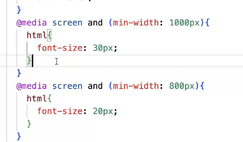
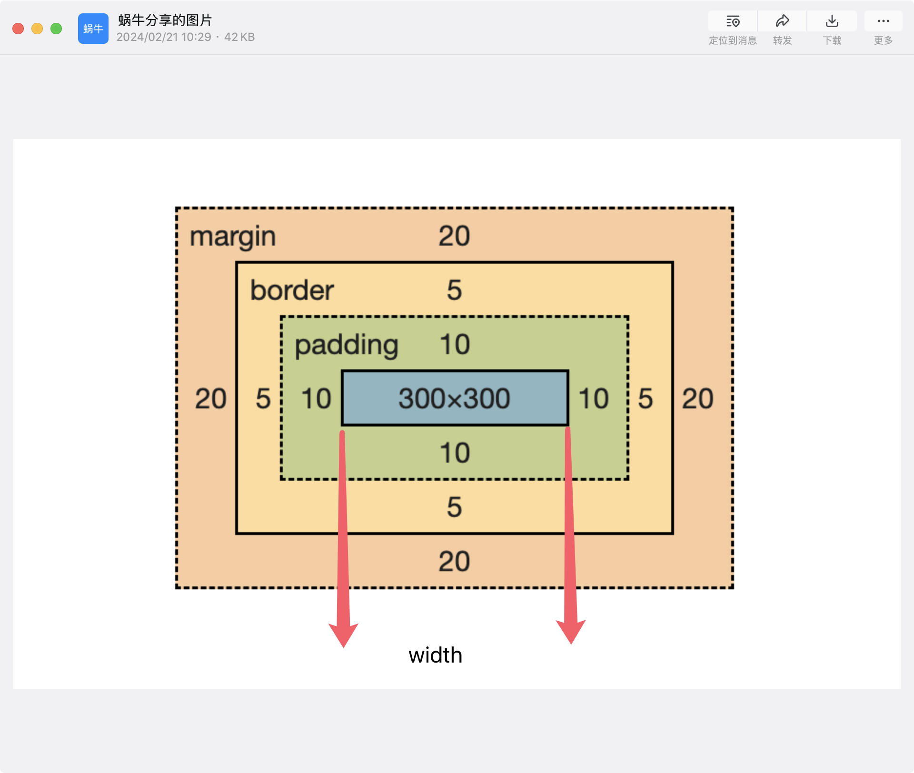
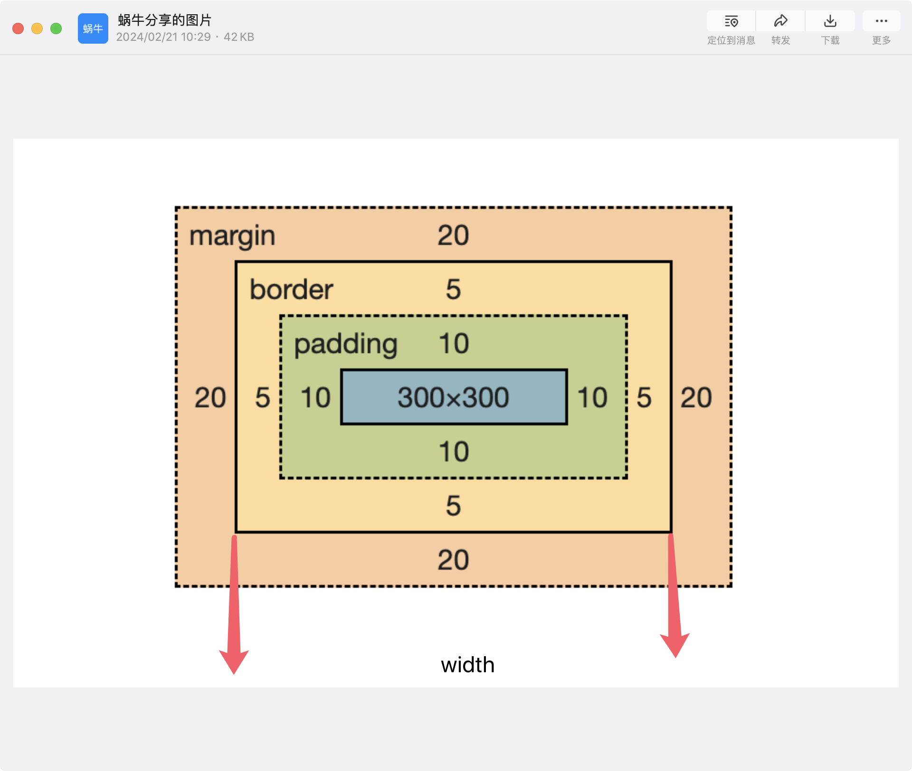

# 0 单位
1. px:像素单位，屏幕上的发光点
2. rem：相对单位，相对于根字体大小
3. em： 相对单位，用于字体上会继承父容器的字体大小，用于其它地方的话当前元素自身的字体大小
4. vw/vh： 相对于单位，相对于窗口宽高比
5. %： 相对于单位，相对于父容器的宽高比

## 说说设备像素，css像素，设备独立像素，dpr，ppi之间的区别

1. pc端 1px == 1个物理像素
2. 页面缩放比为1:1时， 1px == 1个物理像素

设备像素 === 物理像素
css像素 === 1px

设备的独立像素 === 分辨率
黑色框


dpr（设备的像素比）=== 设备像素 / 设备的独立像素
dpr = 1:1 时，设备像素 == 设备的独立像素
dpr = 2:1 时，设备像素 == 设备的独立像素 * 2 高清屏

ppi指的是像素密度（不会被问到）
# 1. 说说你对css盒模型的理解
是什么？ 浏览器在页面布局时，将所有的元素表示为一个个矩形盒子，每一个盒子包含四个部分：content, padding, border, margin

标准盒模型 盒子总宽度：width + padding + border + margin

怪异盒模型(IE) 盒子总宽度: width + margin

1. 是什么：
- css盒子模型是css中的一种布局方式，css盒子模型分为两种：块级盒子模型和行内盒子模型。
- 块级盒子模型（4个部分）：
内边距，外边距，边框，内容

2. 标准盒模型
- 盒子总宽度 内容width+padding+border+margin

按照标准盒模型加载
box-sizing: content-box;


3. 怪异盒模型（ie盒模型）
- 盒子总宽度width+margin
- 设置的宽度会,padding和border会包含在内

要求容器按照ie盒容器加载
box-sizing: border-box;
# 2. css中的选择器有哪些？说说优先级
## 类型
### 1. id选择器

### 2. 类名选择器

### 3. 标签选择器

### 4. 后代选择器
选择所有嵌套在 <div> 元素内的具有 class="content" 的后代元素，赋予浅蓝色背景。
```css
div .content {
  background-color: lightblue;
}

```

### 5. 子级选择器
```css
ul > li {
  list-style-type: square;
}
```
选择直接位于 <ul> 元素下的所有 <li> 子元素，将其列表项符号设为方块。

### 6. 相邻兄弟选择器

```css
/* 选择紧接在 <h2> 元素之后的第一个 <p> 元素，移除其顶部外边距。 */
h2 + p {
  margin-top: 0;
}

```
### 7. 群组选择器
```css
h1, h2, h3 {
  font-family: Arial, sans-serif;
}
/* 同时选择所有 <h1>、<h2> 和 <h3> 元素，设置它们的字体为 Arial 或无衬线字体 */
```
### 8. 属性选择器
```css
input[type="text"] {
  width: 200px;
}
/* 选择所有 type 属性值为 "text" 的 <input> 元素，设定其宽度为 200 像素。 */
```
### 9. 伪元素选择器

### 10. 伪类选择器

!important > 内联 > id选择器 > 类名选择器 > 标签选择器

# 3. 说说css中的单位有哪些？
px : 像素单位，屏幕上的发光点
rem : 相对单位，相对于跟字体大小
em : 相对单位，用于字体上会继承父容器的字体大小，用在它处，是相对于当前容器自己的字体大小来定的
vw/vh : 相对单位，相对于窗口宽高比
% : 相对单位，相对于父容器
# 4. 说说设备像素，css像素，设备独立像素，dpr，ppi之间的区别？
pc端 1px == 1个物理像素
页面缩放比为1:1=时， 1px == 1个物理像素
设备像素 === 物理像素 css像素 === 1px 设备独立像素 === 分辨率 dpr(设备像素比) === 设备像素 / 设备独立像素 ppi === 像素的密度

# 5. css中有哪些方式可以隐藏页面元素？区别是什么？
display: none 脱离文档流 无法响应事件 回流重绘
visibility: hidden 占据文档流 无法响应事件 重绘
opacity: 0 占据文档流 响应事件 重绘 || 不重绘
position: absolute 脱离文档流 无法响应事件 回流重绘
clip-path: circle(0%) 占据文档流 无法响应事件 重绘
# 6. 谈谈你对BFC的理解
是什么 块级格式化上下文，是页面中一个渲染区域，有一套属于自己的渲染规则

渲染规则

BFC容器在计算高度时，浮动元素的高度也会计算在内
BFC容器内的子元素的margin-top不会和BfC这个父容器发成重叠
遵照从上往下从左往右的布局排列
触发条件

overflow: 不为visible
float
display: inline-block || inline-xxx || flex || table-xxx || grid
position: absolute || fixed
应用 清除浮动

# 7. 水平垂直居中的方式有哪些？ !!!!!
position: absolute + translate || margin负值(已知宽高)
flex
grid
table: text-align + vertical-align (子容器不能是块级)
margin(已知宽高)
# 8. 三栏布局怎么实现？
两栏布局：
flex
grid
float + margin-left
三栏布局:
flex
grid
左右先加载内容后加载：float + margin
圣杯布局：float + margin负值 + position:relative
双飞翼布局：float + margin负值

# 9. flex 布局
- 是什么

- 特征
1. 子元素对齐方式
2.
3. 子元素的缩放

- 应用场景
1. 多栏布局
2. 居中


# 10. css3新增的属性有哪些？(记忆就行)

1. 选择器：属性选择器、伪类选择器、伪元素选择器
2. box-shadow: 0 0 0 1px #000;
3. background-clip: text; 裁剪
4. transition (过渡)
5. transform 
6. animation (动画)
7. 渐变色

# 11.css3中常见的动画有哪些怎么实现
1. transition 用于元素的过渡
2. transform 用于容器的选转，平移，缩放，倾斜
3. animation 控制动画的关键帧

# 12.回流重绘
- 是什么
 回流：元素的布局信息发生变化时，会触发回流，重新计算元素的布局信息，重新绘制元素
 重绘：将计算好的布局信息，重新绘制元素
- 触发
 回流：页面上有容器的几何属性发生更改
 重绘：容器的非几何属性发生更改（字体，颜色）
回流必定重绘
重绘不一定回流

# 13. 什么是响应式
- 是什么
根据窗口大小调整页面元素的尺寸
- 实现
1. flex 实现某个容器内的响应式
2. % 适用与于外层的大容器 相对于父容器的大小
3. rem 是一个相对单位，媒体查询查询屏幕宽度，根据宽度来决定rem的大小

4. 媒体查询，可以适用于任何地方但是需要写很多代码
5. vw、vh 适用与于外层的大容器 相对于窗口的大小

# 14.视察滚动效果如何实现
- 是什么
多层背景以不同的速度滚动这就是视察滚动
- 实现：
1. background-attachment: fixed;
2. tranform: translate3d(0, 0, 0);

# 15. css画一个三角形
- ie盒模型，设置边框宽度和盒子宽度一样

# 如何显示一个小于10px的文字
- 新版本的谷歌都支持显示任意像素大小的文字
1. 使用zoom，对字体进行缩放
2. transform: scale(0.5);