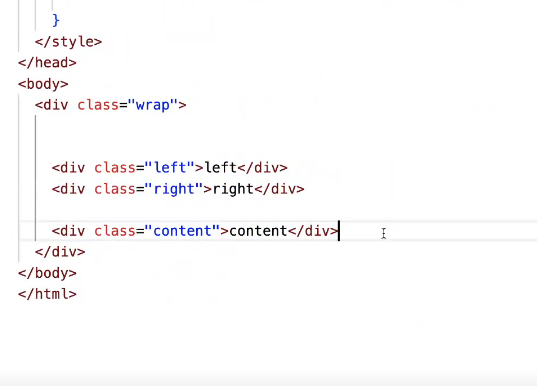

# 圣杯布局
- bug
解决;  
是的，你描述的情况是典型的浮动元素在文档流中的影响。当元素浮动时，它会从文档流中脱离，但仍然会影响其他在文档流中的元素的布局。如果浮动的元素在文档流中被挤到下一行，那么即使该元素被设置为浮动，也不能回到第一行。

这是因为浮动元素会尽量往左或往右移动，直到遇到父元素或其他浮动元素的边界为止。如果浮动元素被挤到下一行，它会继续在下一行的起始位置尽量往左或往右移动，而不会回到上一行。

要解决这个问题，你可以考虑调整元素的宽度、浮动方向，或者使用清除浮动的技巧，比如在需要清除浮动的元素后面添加一个具有clear: both;样式的空元素。这可以防止浮动元素影响后续元素的布局。