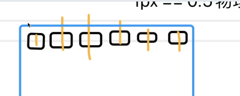

# 单位
1. px:像素单位，屏幕上的发光点
2. rem：相对单位，相对于根字体大小
3. em： 相对单位，用于字体上会继承父容器的字体大小，用于其它地方的话是相对于对当前容器字体大小
4. vw/vh： 相对于单位，相对于窗口宽高比
5. %： 相对于单位，相对于父容器的宽高比

# 说说设备像素，css像素，设备独立像素，dpr，ppi之间的区别

1. pc端 1px == 1个物理像素
2. 页面缩放比为1:1时， 1px == 1个物理像素

设备像素 === 物理像素
css像素 === 1px

设备的独立像素 === 分辨率
黑色框

dpr（设备的像素比）=== 设备像素 / 设备的独立像素
dpr = 1:1 时，设备像素 == 设备的独立像素
dpr = 2:1 时，设备像素 == 设备的独立像素 * 2 高清屏

ppi指的是像素密度（不会被问到）
