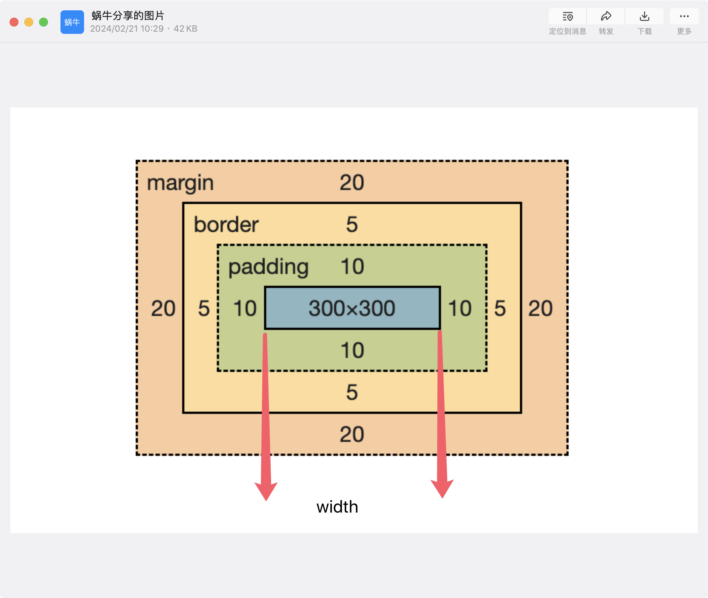

# 请你说说你对css盒子模型的理解
1. 是什么：
- css盒子模型是css中的一种布局方式，css盒子模型分为两种：块级盒子模型和行内盒子模型。
- 块级盒子模型（4个部分）：
内边距，外边距，边框，内容

2. 标准盒模型
- 盒子总宽度 内容width+padding+border+margin

按照标准盒模型加载
box-sizing: content-box;

3. 怪异盒模型（ie盒模型）
- 盒子总宽度width+margin
- 设置的宽度会,padding和border会包含在内

要求容器按照ie盒容器加载
box-sizing: border-box;
