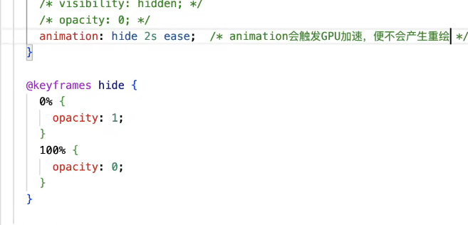

# css中有哪些方法可以隐藏元素，区别是啥？
1. display: none;           // 脱离文档流    不响应点击事件   回流重绘
2. visibility: hidden;      // 占据文档流    不响应点击事件     重绘
3. position: absolute;      //脱离文档流    不响应点击事件   回流||重绘
4. opacity: 0;              // 占据文档流    可以响应点击事件  回流重绘
- 不触发重绘的情况：(gpu加速)

5. clip-path:circle(50%);   //占据文档流     无法响应事件     重绘
  重绘