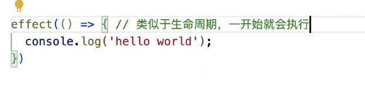

# map
map 键值对,键可以让任何类型作为键
weakmap 垃圾回收机制不将其考虑在内,性能更高,内存回收更加友好

# reactive

reactive 只能将引用类型代理成为响应式,是因为 proxy 只接受响应式

被代理对象中的任意属性,发生修改都应该用到了这个属性的各个函数重新执行一遍,在此执行之前需要为每一个属性做好副作用函数的收集

- 代理:将对象代理为proxy对象
- 收集:在代理函数get中对使用属性做副作用的函数收集
- 触发:在代理函数set中,将收集的函数依次执行一遍

# reflect

将 es6 以及之后的所有隶属于 object 对象上的方法转移到 reflect 对象上,方便使用(解决一些程序报错问题)
配合 proxy 使用

# effect
