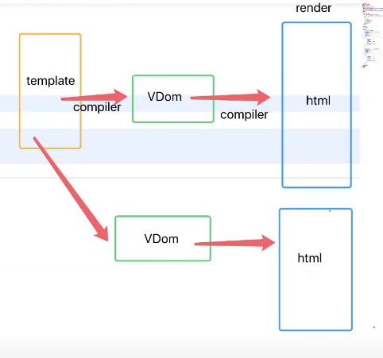
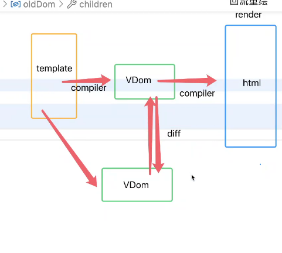
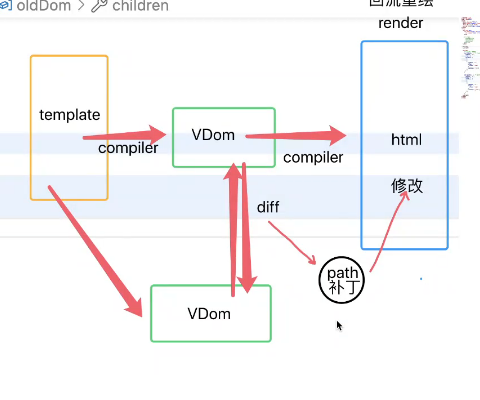
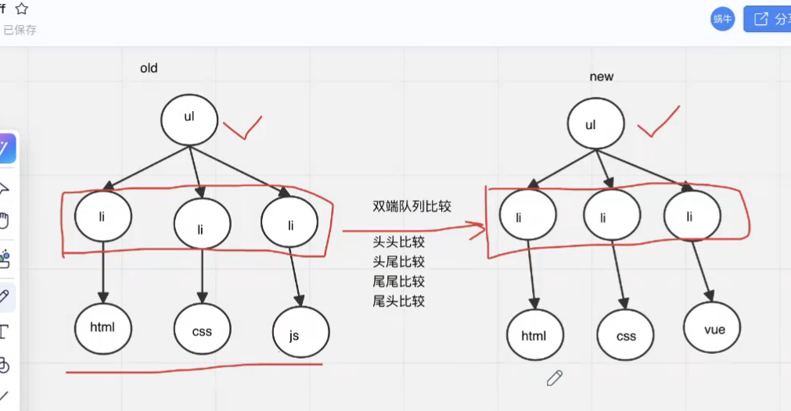

# 虚拟dom
- 页面更新
- 两个dom结构进行比较(使用diff算法找不同生成补丁)
 生成补丁使用补丁修改,大大降低回流重绘的开销

# diff
- 将新老VDOM的不同点找到
- 过程:
1. 同层比较不同节点,节点不同直接废弃老DOM ;
2. 是相同节点,比较节点上的属性,产生一个补丁包
3. 继续比较下一层的子节点,采用双端队列的方式,尽量复用,补丁包

# vue中为什么不建议使用index做key
- 为什么要有key?
让diff比较时效率更高

- 为什么不能用index做key
因为index是变化的,(下标永远是从0开始,哪怕数据只是发生了位置变化,key就会不一样)所以diff比较时,每次都会重新生成补丁包,导致页面回流重绘,影响性能