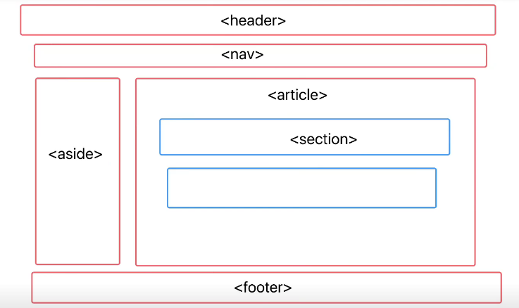
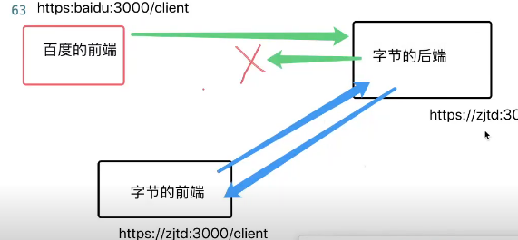

# 自我介绍
姓名 +学校 +做做过生什么 +有什么成绩 +为什么能胜任(ai)

对ai非常感兴趣

# 1.数组上的方法 在在js中的意义?

var a = []
a.push()
a.pop()

1. 创建 对象字面量在V8的执行过程中相当于,new了一个构造函数,通常我们是不去直接new构造函数永威够简洁直观,

2. 因为a相当于 new Array()得到的,a的隐式原型(_proto_)===Aarray.prototype
v8查找属性的时候会出现在对象查找上面,找不到就会顺着对象的原型往上找

3. new会创建一个新的对象

让该对象的隐式原型等于构造函数的现实原型

this指向该对象

返回该对象

# 2.promise有几种状态,可以重复改变吗
3中状态不能更改

- 熟悉其它方法及其源码

- 如何实现一个红绿灯算法

# 3. 输出题
const obj1 = {a:1}
const obj2 = {a:2}
console.log(obj1 == obj2)
console.log(obj1 === obj2)

首先两个等号只会判断值相等,发生隐式转化
会发生字符串,但对象的判断规则当中会有判断引用地址

三个等号是严格相等,不发生类型转换,通过比较类型是否相同,值是否相同

# 4. 语义化标签
- 有哪些;header nav aside article section footer
- 优点
可读性好,搜索引擎优化SEO,更好地支持更多终端
  
    - 使用语义化标签可以给搜索引擎提供更多的信息,
    爬虫爬取的有一定的顺序
    ,使用语义化标签能够让爬虫更快的找到页面的关键内容,

    

# 5. 算法
斐波那契

递归->优化dp

动态规划经典题目

# 6. 用过什么ai工具
1. chagpt  (刻意练习prompt的技巧,生成简单的前端网页)

2. copilot 提升编码速度提升开发效率

3. 最近在学习 transform,openai技能,对大模型很感兴趣,也在学习Langchain,LLM

准备一个大模型,能聊个5-6句

虚心请教一些问题,吹捧一下,毕竟以后也是一起工作的

4. 自己准备一个大模型,介绍你对它的理解

# 7.请你讲一讲http的请求三次握手

先通过ip协议找到服务器的ip地址,然后通过tcp协议建立连接,通过http协议发送请求

1. 客户端发送请求连接到服务器,客户端进入SYN-SENT状态
2. 服务端收到请求,发送SYN-ACK,客户端收到,进入SYN-RECV状态
3. 客户端收到请求连接报文后,返回一个确认收到的报文应答(包含ACK序号)

- 为什么要三次握手

假设客户端给服务端发送了一个建立连接请求A,但是因为网络环境差,这个请求就超时了,那么TCP会启动超时重传机制,再发送一个新的建立连接请求B服务端接收到B请求后答应,如果此时完成建立连接的话,当客户端和服务端通信完成后,便释放了连接,双方进入Closed状态。假设此时A请求有抵达了服务端，那么服务端就会认为客户端又要建立新的链接从而打印该请求并进入RECEIVED状态，而此时客户端是CLOSED状态，那么服务端就会一直等待造成资源浪费

因为超时重传机制，超过5次之后会面自动就会关闭

# 跨域问题
- 什么是跨域
后端返回的数据会被浏览器的同源策略给拦截下来

  https://198.168.31.45:8080/user
   协议号:域名:端口号/路径

- 为什么需要跨域
如果说直接发送请求就能返回的数据就没有安全性可言的

- 什么是同源策略
协议号-域名-端口号 都有相同的地址,浏览器才认为是同源
公网ip是世界上独一无二的

非同源的请求的话,请求会被浏览器拦截

发生在响应阶段
# 解决跨域

但是在实际开发当中,就会存在跨域问题
如果两台电脑在同一个局域网下,ip地址会不一样,发送请求就会被拦截

同一台电脑的话端口号会不一样,也会有跨域问题

虽然安全但是这样的话程序员开发的话无法调试程序

1. jsonp
  - ajax请求受同源策略的影响，但是script标签的src属性不受不受同源策略的影响，且该属性也会导致浏览器发送一个请求
  - 通过script标签的src属性发送请求，可以绕过同源策略，但是只能发送get请求，不能发送post请求，而且只能发送jsonp请求，不能发送ajax请求

缺点
1. 必须要后端的配合
2. 而且只能是get请求不能是post请求
  因为是浏览器加载资源的请求,而浏览器加载资源请求是get请求,所以只能是get请求

2. cors方案

cross= (Origin resource Sharing)
后端通过设置响应头来告诉浏览器不要拒绝接受后端的响应
跨域是浏览器不接受后端的响应
想个办法让浏览器不得不接受

3. node代理 (vite 开发环境下生效,但是部署到服务器上还是跨域了)

axios.get('/api')
vite帮我们启动了一个node服务,且帮我们朝
发送了请求,因为后端没有同源策略,所以vite中的node服务能直接请求到数据,再提供前端使用

4. ngix代理  (类似与cors,配置白名单) (生产环境下常用)

5. domain (在iframe中,当父级页面和子集页面 的子域名 不同时,通过设置 documnet.domain = xx,来将xx定为基础域,从而实现跨域 )

6. 管道通信PostMesage