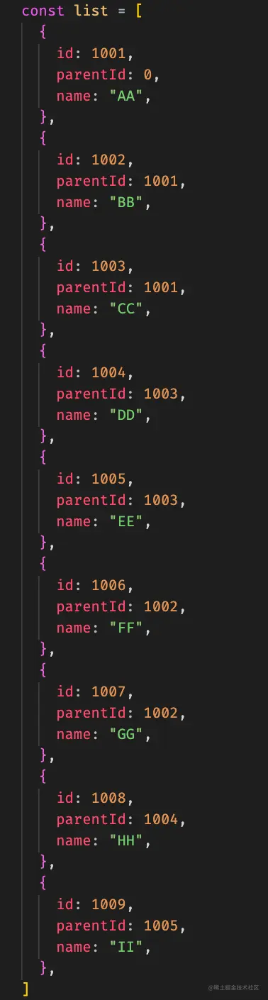

- 调试自己的代码

断点 逐步跟进 变量的值
console.log
使用 vue 的 devtool 数据状态界面统一

console.time console.timeEnd() 性能优化
浏览器自带性能面板

- 网络请求
  使用 postman 测试接口

- 状态码 深入
  304

- node stream

- vuex/pinia
  - vuex 的状态管理 父子组件通信之外 让状态在任何组件之间共享
  - pinia 的持久化储存,刷新之后的状态仍然存在
  - vuex 的缺点 不太好理解 mutations
  - pinia hooks 函数化 对 ts 的支持更好
- 持久化
  localStorage+JSON.parse() JSON.stringify()

  - 深度优先广度优先

- 面得怎么样

  - 学习建议
  - 机会很难的

- vue 的生命周期

  - 生命周期的执行顺序
    两个父子组件的
    父 created
    子 created
    子挂载 mounted
    父挂载 mounted

  created 创建在内存中
  onmounted
  AIGC 快速学习高效开发,代码助理

- 手写 ts 刷一点
  interface type 区别
  :string[]

总结:
top20 的面试难度主要在于基础能力 算法 vue 基础 js/css 八股文

- 树的遍历
  用递归的概念来定义一棵树

BFS,DFS
先序遍历
中序遍历
后序遍历

- 二叉树的遍历

深度优先适合递归

## B 站

列表组装成树装结构

- 经典题
- 树型
- 常见的困难开发点拿出来
  多级菜单、省县市的选择需求
  - 列表后端传过来的数据项，一条条记录
    后端传递过来的数据项
    任务 拼成树形结构
    形式菜单 切换地址选项等树形结构
  - 使用两重for循环 O(n^2)
- 编写一个类 EventEmitter 实现自定义事件
  - 前端 addEventListener click内置事件
  - 订阅发布者模式 经典的设计模式
    
  - 实现一个 eventEmitter 类 on emit off once

  - node内置了eventEmitter 可以直接继承使用

