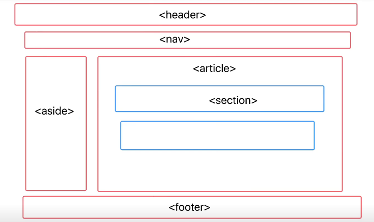

# 自我介绍
姓名 +学校 +做做过生什么 +有什么成绩 +为什么能胜任(ai)

# 1.数组上的方法 在在js中的意义?

var a = []
a.push()
a.pop()

1. 创建 对象字面量在V8的执行过程中相当于,new了一个构造函数,通常我们是不去直接new构造函数永威够简洁直观,

2. 因为a相当于 new Array()得到的,a的隐式原型(_proto_)===Aarray.prototype
v8查找属性的时候会出现在对象查找上面,找不到就会顺着对象的原型往上找

3. new会创建一个新的对象

让该对象的隐式原型等于构造函数的现实原型

this指向该对象

返回该对象

# 2.promise有几种状态,可以重复改变吗
3中状态不能更改

- 熟悉其它方法及其源码

- 如何实现一个红绿灯算法

# 3. 输出题
const obj1 = {a:1}
const obj2 = {a:2}
console.log(obj1 == obj2)
console.log(obj1 === obj2)

首先两个等号只会判断值相等,发生隐式转化
会发生字符串,但对象的判断规则当中会有判断引用地址

三个等号是严格相等,不发生类型转换,通过比较类型是否相同,值是否相同

# 4. 语义化标签
- 有哪些;header nav aside article section footer
- 优点
可读性好,搜索引擎优化SEO,更好地支持更多终端
  
    - 使用语义化标签可以给搜索引擎提供更多的信息,
    爬虫爬取的有一定的顺序
    ,使用语义化标签能够让爬虫更快的找到页面的关键内容,

    

# 5. 算法
斐波那契

递归->优化dp

动态规划经典题目

