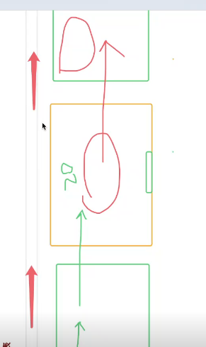

# 一次渲染10万条数据

- 理解:
当一次性要渲染很多数据的时候呢,js的计算并不是性能问题,主要的问题其实是数据在页面上的渲染问题
- 猜想:
一次性放好的数据,在页面上渲染,但是浏览器的优化策略是同一个元素的渲染会有一个优化队列的机制,但是我们这里并不是,修改同一个元素,而且该队列的长度也是有限的,当超过,就会执行队列的任务又会产生性能问题
- 解决方法:
1. 时间分片
1.1  setTimeout
dom结构的渲染和页面的刷新率不同步造成闪烁
1.2  window.requestAnimationFrame
浏览器不需要一次性渲染上万条数据,而是分批渲染,而且浏览器会自动优化,不会出现闪烁

但是回流的次数并没有减少
1.3 requestAnimationFrame+fragment  //时间分片
减少了回流次数

2.  使用虚拟列表
所有端使用虚拟列表来解决最优雅

拿到上万条数据
获取可视区域的高度
滚动页面的过程当中实时计算可视区域可以展示数据,起始下标和结束下标, 去原数组当中截取要展示的数据
- 学到的其它点:
定时器是浏览器的,不是js自带的
浏览器的主线程切换之类的

定时器的回调函数是交给浏览器的事件队列来执行的
定时器的时间没有和屏幕刷新时间对上,然后就会有闪烁的感觉
  window.requestAnimationFrame
  也是一个定时器只是该定时器的时间是和屏幕刷新时间是一致的

- 在线引入vue的话呢
需要将引入标签放在head里面,不然浏览器一开始可能读不懂vue的语法
   